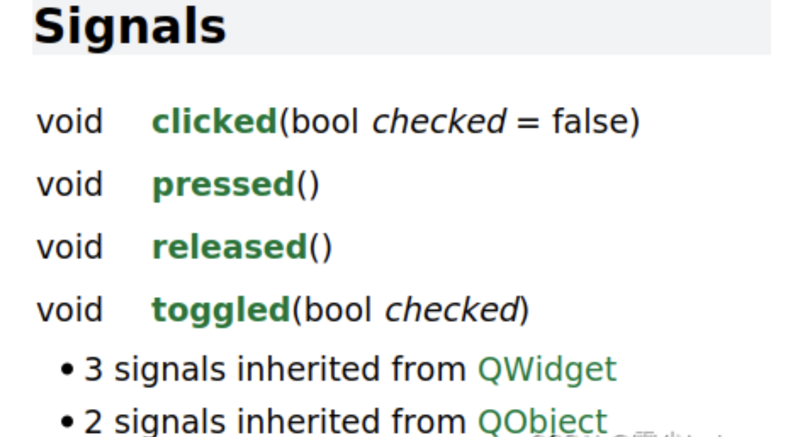

[TOC]

一、QT是什么？
===

Qt是一个跨平台的C++图形用户界面应用程序框架。它为应用程序开发者提供建立图形界面所需的所有功能。它是完全面向对象的，很容易扩展，并且允许真正的组件编程。

二、基础内容
===

1、pro文件规则及含义
---

1、注释: 从“#”开始，到这一行结束。
2、模块引入: QT += 模块名，表示当前项目引入Qt哪些模块。
模板变量(TEMPLATE)指定生成makefile的类型。
◦ TEMPLATE =app -建立一个应用程序的makefile。(默认值)
◦ TEMPLATE =lib - 建立一个库的makefile。
◦TEMPLATE = vcapp - 建立一个应用程序的VisualStudio项目文件。
◦ TEMPLATE =vclib - 建立一个库的VisualStudio项目文件。
◦ TEMPLATE =subdirs -创建一个能够进入特定目录并且为一个项目文件生成makefile并且为它调用make的makefile。
4、指定生成的应用程序名： TARGET = NAME
5、工程中包含的头文件：HEADERS += *.h
6、工程中包含的.ui设计文件：FORMS += *.ui
7、工程中包含的源文件：SOURCES += *.cpp
8、工程中包含的资源文件：RESOURCES += *.qrc
9、greaterThan(QT_MAJOR_VERSION, 4): QT += widgets，其含义为如果QT_MAJOR_VERSION大于4需要增加widgets模块。
10、配置信息：
CONFIG用来告诉qmake关于应用程序的配置信息。
CONFIG += c++11使用c++11的特性

2、Widget头文件
---

Q_OBJECT：宏，引入qt信号和槽的一个宏

示例：

```
MyWidget(QWidget *parent = 0);
```

其中，参数parent是一个窗口指针，代表父窗口对象的指针（用于指定类之间的父子关系），以按钮为例，若想要按钮显示在某窗口上，就要跟该窗口建立起父子关系。
如果parent为0或者NULL，则表示当前窗口对象是个顶层窗口（是在任务栏可以找到的窗口）。

3、QT坐标系的定义
---

顶层窗口以屏幕的左上角为(0，0)
其他窗口以其父窗口的左上角为(0，0)
坐标轴的正方向为：x轴水平向右，y轴竖直向下

相关的API函数有：

```
	move(x,y)//移动窗口到父窗口(x,y)坐标
	resize(w,h)//重新设置窗口的大小width=w,height=h
	setFixedSize(w,h)//设置窗口的固定大小width=w,height=h
	setWindowTitle(title)//设置窗口标题
	setGeometry(x,y,w,h)//同时设置窗口位置和大小，相当于move和resize的结合体
```

4、QApplication应用程序类
---

示例：

```
QApplication a(argc, argv);
```

创建一个QApplication对象，作用是维护qt应用程序生命，每个qt程序有且仅有一个QApplication对象，它也处理应用程序的初始化和结束，并且提供对话管理。

```
a.exec();
```

这是一个死循环，在exec()中，Qt接受并处理用户和系统的事件并且把它们传递给适当的窗口部件。是qt程序的生命循环、消息循环。

5、按钮：QPushButton
---

示例：

```
QPushButton * btn = new QPushButton; 
```

创建一个QPushButton对象，依赖于qt的内存管理机制（父对象释放的时候会自动释放各个子对象），可以不进行free/delete操作释放内存。
指定QPushButton对象的父窗口，可以使用setParent()函数或者直接构造函数传参。

6、信号和槽
---

基本关系：信号发送者、信号、信号接收者、槽（即信号的处理动作）
注：信号本质是事件，表现形式是函数；槽的本质是对信号的一个处理函数。

### 6.1 标准信号和槽

利用帮助文档，在QAbstractButton 中就可以找到关键字signals，点击signals索引到系统自带的信号有如下几个：



clicked：鼠标点击按钮一次，信号就会被触发
pressed：鼠标的左键 | 右键按下，信号就会被触发
released：按钮被释放，信号就会被触发
toggled：在Button状态（开、关）切换时会被触发

### 6.2 connect的使用

示例：

```
conncet(sender，&SenderCLass::signal，receiver，&ReceiverClass::slot);//qt5的用法

connect(sender, SIGNAL(signal), receiver, SLOT(slot));//qt4的用法
```

使用qt4的用法对于信号和槽的函数重载容易区分，qt5的用法更有利于程序错误排查。

### 6.3 自定义信号和槽

#### 自定义信号

- 函数声明在类头文件的signals 域下面

- void 类型的函数，没有返回值
- 可以有参数，也可以重载
- 只有声明，没有实现定义
- 触发信号 emit obj->sign(参数…)

#### 自定义槽

- 函数声明在类头文件的public/private/protected slots域下面（qt5 可以声明在类的任何位置，可以是静态成员函数、全局函数、lambda表达式）

- void 类型的函数，没有返回值
- 可以有参数，也可以重载
- 不仅有声明，还得有实现

**注：使用connect之前要先创建SenderCLass和ReceiverClass的对象以作为信号的发送者和接受者。若存在函数重载，需要解决参数二义性问题：**

- 使用函数指针赋值，让编译器自动挑选符合类型的函数
- 使用static_cast 强制转换 ，让编译器自动挑选符合类型的函数

### 6.4 信号和槽的拓展

#### 一个信号可以连接多个槽

一个信号建立了多个connect，那么当信号发射的时候，槽函数的调用顺序是随机的

#### 一个槽可以连接多个信号

#### 信号可以连接信号

connect(第一个信号发送者，第一个信号，第二个信号发送者，也作为第一个信号的接收者，第二个信号)

#### 信号可以断开连接,使用disconnect函数

disconnect参数使用方法与connect相同

#### 信号和槽的参数关系，必须同时满足以下两点

##### 信号和槽函数的参数类型必须对应

##### 信号和槽函数的参数个数可以不一致，但是信号函数参数个数必须大于等于槽函数参数个数

7.lambda表达式
---

标准格式：

```
capture](parameters) opt ->retType
	{
	……;
	}
```

- []：中括号内没有内容，表示lambda表达式不能访问外部函数体的任何局部变量
- [a]：在函数体内部使用值传递的方式访问a变量
- [&b]：在函数体内部使用引用传递的方式访问b变量
- [=]：函数外的所有局部变量都通过值传递的方式使用
- [&]：函数外的所有局部变量都通过引用的方式使用
- [=, &a]：a使用引用方式, 其余局部变量是值传递的方式使用
- [&,a]：a使用值传递方式, 其余局部变量是引用传递的方式使用
- [this]：在函数内部可以使用类的成员函数和成员变量，=和&形式也都会默认引入

注：值传递的方式捕获的变量默认是const ，若在函数体中需要对该变量进行修改的话要使用 mutable选项