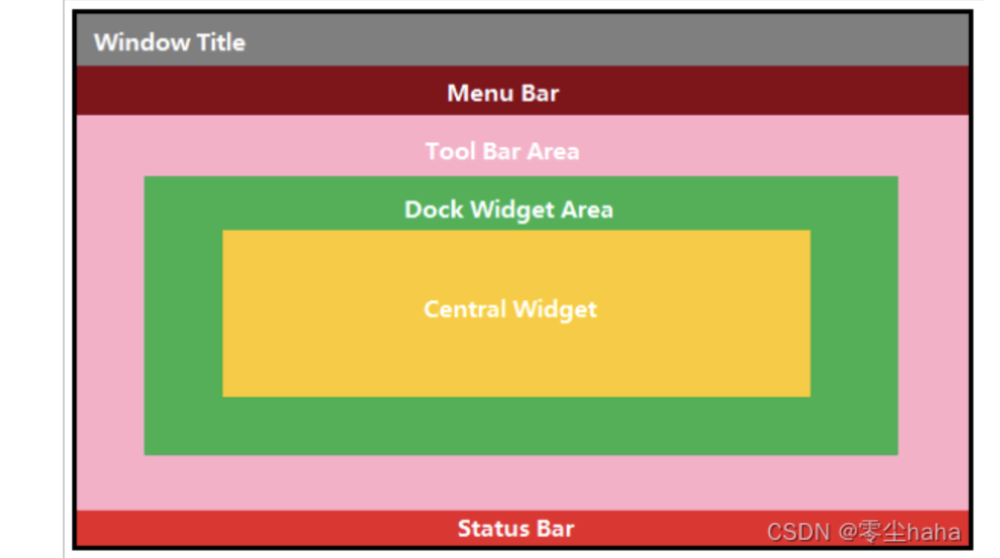
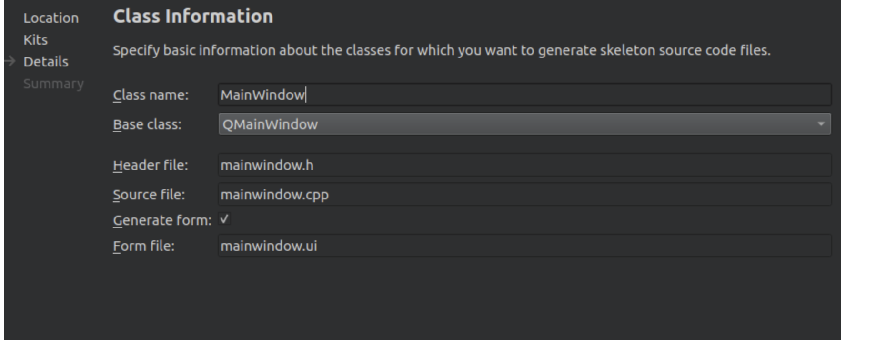
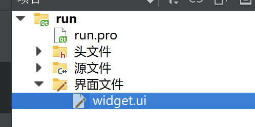
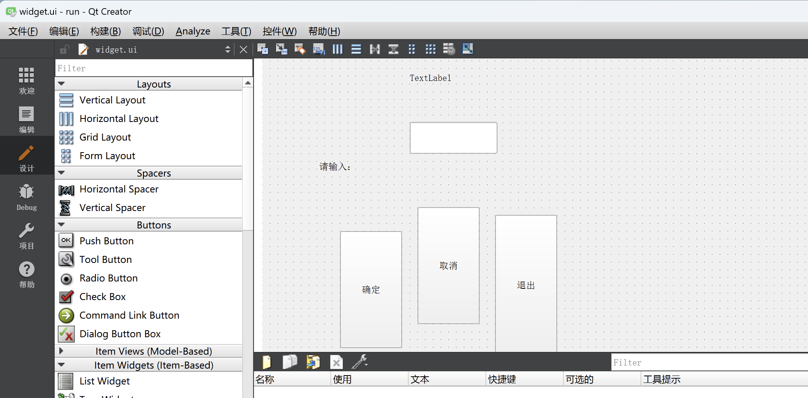
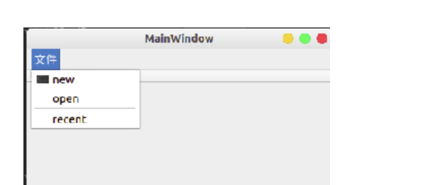

[TOC]


一、QMainWidow
===

QMainWidow是一个程序框架，有自己的布局，可以在布局中添加控件，如将工具栏添加到布局管理器中。
其中包括了菜单栏Menu Bar（仅一个）、工具栏Tool Bar Area（可以有多个）、状态栏Status Bar（仅一个）、停靠部件Dock Widget Area（也称为铆接部件 、浮动窗口，可以有多个）和核心部件Central Widget（仅一个），布局如下图：



代码示例：

```
QMenuBar *mb = this->menuBar(); //menuBar()函数会返回当前窗口的菜单栏，
					 //如果当前窗口没有设置菜单栏，则该函数会自动生成一个菜单栏
QMenu *menuFile = mb->addMenu("文件"); //向菜单栏中添加菜单，
                                     //也可以用于向n阶级菜单中添加n+1级菜单				 
Qction *actionNew = menuFile->addAction("新建");	//向菜单中添加菜单项
menuFile->addSeparator(); //向菜单栏中添加分割线
```

```
QToolBar *tb = this->addToolBar("");	//在当前窗口创建工具栏，可以有多个
                             //所以函数名中含有add		
toolBar->addAction(actionNew); //向工具栏中添加工具
this->addToolBar(Qt::LeftToolBarArea,tb); //指定工具栏停靠的位置
//可选参数有Qt::LeftToolBarArea、Qt::RightToolBarArea、Qt::TopToolBarArea、
//Qt::BottomToolBarArea、Qt::AllToolBarAreas、Qt::NoToolBarArea
toolBar->setAllowedAreas(Qt::LeftToolBarArea|Qt::RightToolBarArea);//设置工具栏只允许停靠的位置
toolBar->setFloatable(false); //设置窗口不允许浮动，默认为true
toolBar->setMovable(false); //设置窗口不允许拖动，默认为true
```

```
QStatusBar *sb = this->statusBar(); //与菜单栏类似，获取当前窗口的状态栏，
                                   //没有的话就自动创建
//往状态栏里边添加信息
//添加左侧信息
QLabel *labelL = new QLabel("左侧信息",this);
sb->addWidget(labelL);//状态信息靠左边显示，有多个的话依次向右排列
//添加右侧信息
QLabel *labelR = new QLabel("右侧信息",this);
sb->addPermanentWidget(labelR);//状态信息靠右边显示，有多个的话依次向左排列
```

```
QDockWidget *dockWidget = new QDockWidget("停靠部件",this);
this->addDockWidget(Qt::BottomDockWidgetArea,dockWidget);//默认情况下，如果没有核
                                       //心部件作为参照物，停靠部件会自动占满窗口
```

```
QTextEdit *textEdit = new QTextEdit(this); //以QTextEdit对象作为核心部件为例
this->setCentralWidget(textEdit); //添加核心部件
```

注： 在使用上述QT类时，需要引入相应的头文件，即

```
#include <QMenuBar>

#include <QToolBar>

#include <QStatusBar>

#include <QLabel>

#include <QDockWidget>

#include <QTextEdit>
```

二、ui、资源文件文件
===

1.ui的简单说明
---

- 使用ui进行操作，在创建项目的时候需要保留ui的勾选（默认值）



- 以上图为例，创建项目后，在mainwindow.cpp文件中，出现

```
 ui->setupUi(this);   //其作用为：关联ui文件到程序界面
```

- 项目目录中，出现mainwindow.ui的文件，双击该文件进入qt的ui设计界面




- 需要使用ui中创建的对象时，直接使用 ui->对象名 即可获得窗口对象的指针。

2.资源文件的使用
---

以为如下的ui界面中new选项添加icon为例：



方式一：通过绝对路径使用资源
代码示例：

```
ui->actionnew->setIcon(QIcon("绝对路径"));
```

方式二：使用qt的资源文件

- 首先要在qt的项目文件夹中新建资源文件。具体槽作为：项目添加文件 - > qt - > qt resource file -> 文件名.res
- 创建完成后在引导界面内添加前缀 / ，并添加文件（文件只能是存放在项目文件夹下的）
- 使用资源文件的方式：冒号 : + 前缀 / + qrc文件中的文件名

代码示例：

```
ui->actionnew->setIcon(QIcon(":/1.png"));
```

添加完icon后，结果如图：



三.对话框
===

- 对话框是一种没有最大化、最小化按钮的窗口。
- 引入头文件：

```
include <QDialog>
```

1 模态对话框
---

- 对话框还没有关闭前不能操作同一个进程的其他窗口

创建模态对话框

```
QDialog dlg(this);
dlg.exec();   //模态窗口的生命循环，有阻塞作用
```

2 非模态对话框
---

- 对话框没有关闭前也能操作其他窗口

创建非模态对话框：使用show 函数，直接显示窗口

```
 QDialog *dlg = new QDialog(this);
 dlg->show();
```

### 问题

！上述代码存在内存释放的问题，即当父窗口长期存在并且多次调用非模态对话框，会导致内存不断增加（即使关闭相应的非模态对话框也不会使内存占用减少）

一种解决办法

```
 QDialog *dlg = new QDialog(this);
 dlg->setAttribute(Qt::WA_DeleteOnClose); //通过设置窗口的属性，让它关闭的时候自动释放
 dlg->show();
```

