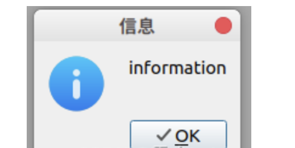
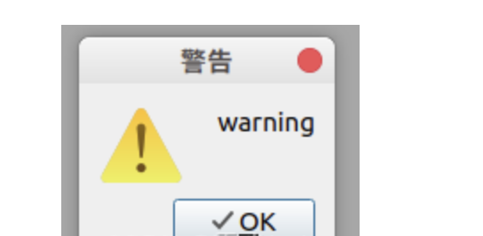
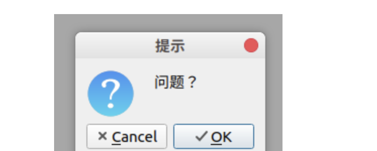
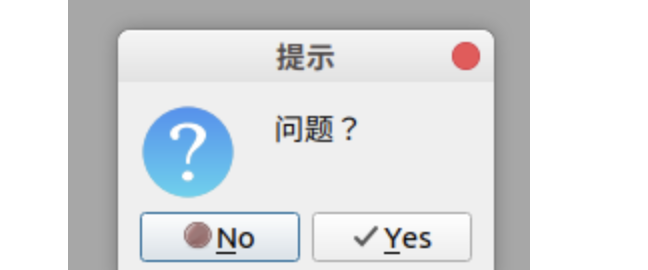

[TOC]


一、系统标准对话框
===

1、QMessageBox：用来提示用户某条信息
---

等级划分为：
**info**
**warning**
**critical**
**question**
使用时需要引入头文件：

```
include <QMessageBox>
```

使用方法：

```
QMessageBox::information(this,"信息","information");
QMessageBox::warning(this,"警告","warning");
QMessageBox::critical(this,"错误","critical");
```

对话框如下图：






question的使用与以上三者略有不同

```
QMessageBox::question(this,"提示","问题？",
                          QMessageBox::Ok|QMessageBox::Cancel))  //指定按钮内容
```



```
QMessageBox::question(this,"提示","问题？",
                          QMessageBox::Yes|QMessageBox::No))
```



判断用户点击了哪一个按钮，可以使用

```
 if(QMessageBox::Yes==
            QMessageBox::question(this,"提示","问题？",
                          QMessageBox::Yes|QMessageBox::No))
    {}
```

2、文件对话框
---

使用QFileDialog 来打开一个文件对话框，使用时，需引入头文件：

```
include <QFileDialog>
```

使用方法如下：

（1） 单文件

```
QString fileName = QFileDialog::getOpenFileName(this,"打开一个文件",
                    "指定默认打开文件夹路径",
                  "PNG (*.png) ;; JPG (*.jpg) ;; GIF (*.gif) ;; all (*.*)");
                  // 函数返回值为选中文件的路径，其类型为QString
                  // 指定文件过滤器，格式： "类型名称 ( *.类型后缀 ...) ;; ... "
```

（2）多文件

```
QStringList fileNames = QFileDialog::getOpenFileNames(this,"打开一个文件",
                    "指定默认打开文件夹路径",
                  "PNG (*.png) ;; JPG (*.jpg) ;; GIF (*.gif) ;; all (*.*)");
                  // 函数返回值为选中多个文件各自的路径，其类型为QStringList

```


二、界面布局
===

分为静态布局和动态布局

静态布局就是位置和大小不会跟着外部窗口变化而变化
---

动态布局就是位置和大小会跟着外部窗口变化而变化（常用）
---

常用的动态布局
水平、垂直、栅格、表单布局（可以通过widget自带的布局功能实现）

使用弹簧(Spacers)来调整布局的位置，居中

栅格布局可以将空间分为几行几列的表格，方便对齐

默认情况下动态布局，子窗口的大小会跟着父窗口的大小变化而变化，可以调整水平或者垂直策略，变成固定

调整子窗口和父窗口之间的间隙，需要设置父窗口的margin （有四个值，分别调整上ia左右的间隙），调整子窗口之间的间隙可以通过调整弹簧的size实现。


调整窗口的固定大小，需要将窗口的最大值和最小值都设为同一个值即可
