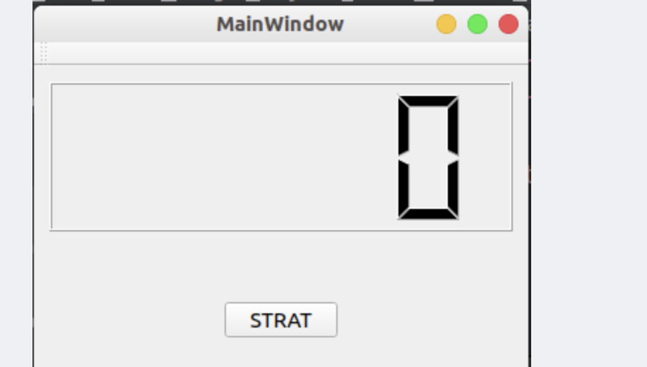

[TOC]


什么是线程
===

在多核时代，CPU 的主频已经进入瓶颈。想要提高程序运行效率就要使用线程，充分利用多核CPU的优势。
线程一般可以看做是“轻量级进程”，可以由**操作系统管理**，也可以由**应用程序管理**。
一般是在执行多任务的时候需要用到计算机的线程进程，简单来说就是可以跑多个**while(1)**

qt的线程
===

默认的线程在qt中称之为窗口线程，即**主线程**，负责窗口事件处理或者窗口控件数据的更新
子线程负责后台的各种逻辑处理，子线程中**不允许**对窗口对象做任何的直接操作，这些操作需要交给**主线程**处理
qt中主线程和子线程之间进行信息传递，需要使用到**qt的信号槽机制**

一、线程类QThread
===

Qthread是qt中提供了一个线程类，通过这个类可以创建子线程。

1、常用的成员函数
---

```c++
// （1）构造函数：
QThread::QThread(QObject *parent = Q_NULLPTR);
// （2）判断线程中的任务是否处理完毕：
bool QThread::isFinished() const;
// （3）判断子线程是否正在执行任务
bool QThread::isRunning() const;
// （4）得到当前线程的优先级
Priority QThread::priority() const;
// （5）设置线程的优先级
void QThread::setPriority(Priority priority);
//优先级:
//    QThread::IdlePriority         --> 最低的优先级，仅在没有其他线程运行时调度
//    QThread::LowestPriority       
//    QThread::LowPriority
//    QThread::NormalPriority
//    QThread::HighPriority
//    QThread::HighestPriority
//    QThread::TimeCriticalPriority --> 最高的优先级， 尽可能频繁地调度
//    QThread::InheritPriority      --> 默认值
// （6）退出线程, 停止底层的事件循环
// 退出线程的函数
void QThread::exit(int returnCode = 0);
// 调用线程退出函数之后, 线程不会马上退出
// 因为线程当前的任务有可能还没有完成
// 一般情况下会在 exit() 后边调用wait函数
bool QThread::wait(unsigned long time = ULONG_MAX);
```

2、信号和槽
---

```c++
[slot] void QThread::quit(); // 和调用 exit() 效果是一样的,调用这个函数之后, 再调用 wait() 函数

[slot] void QThread::start(Priority priority = InheritPriority); // 启动子线程

[slot] void QThread::terminate();// 线程退出, 可能是会马上终止线程
//（即使线程当前的任务还没有完成）, 一般情况下不使用这个函数

[signal] void QThread::finished();// 当线程中执行的任务完成了, 会发出该信号

[signal] void QThread::started();// 线程开始工作之前发出这个信号, 一般不使用
//一般认为调用start槽函数线程便开始工作
```


3、静态函数
---

```c++
[static] QThread *QThread::currentThread(); // 返回一个指向当前执行线程的QThread的指针

[static] int QThread::idealThreadCount(); // 返回可以在系统上运行的理想线程数
//（和当前电脑的 CPU 核心数相同）

// 线程休眠函数
[static] void QThread::msleep(unsigned long msecs);	// 单位: 毫秒
[static] void QThread::sleep(unsigned long secs);	// 单位: 秒
[static] void QThread::usleep(unsigned long usecs);	// 单位: 微秒
```

4、进程的任务处理函数
---

```c++
[virtual protected] void QThread::run(); // 这是个虚函数
//子线程需要处理什么任务, 需要重写到 run() 中
```

- run() 是一个虚函数，使用时一般需要写一个子类让其继承 QThread，并且在子类中重写QThread的 run() 方法，函数体就是对应的任务处理流程。
- run() 是一个受保护的成员函数，不能够在类外调用，一般通过当前线程对象调用槽函数 start() 启动子线程，当子线程被启动时，这个 run() 函数也就在线程内部被调用了。

二、使用方式
===

1、方式一
---

特点是： **简单**

### 1.1 使用步骤

（1）创建一个线程类的子类，让其继承 QThread
示例

```c++
class ClassName:public QThread
{
    ...
}
```

（2）重写QThread的 run () 方法，在该函数内部编写子线程具体的处理逻辑
示例

```c++
class ClassName:public QThread
{
    ...
 protected:
    void run()
    {
        //子线程期望实现的操作逻辑
        ...
    }
}
```

（3）在主线程中创建子线程对象
示例

```c++
ClassName * subThread = new ClassName;
```

（4）启动子线程
示例

```c++
subThread->start();
```

### 1.2 案例演示

在下面的窗口中，点击按钮开始在子线程中数数，通过信号槽机制将数据传递给主线程，通过主线程将数据更新到窗口中。



#### mysubthread.h

```c++
#ifndef MYSUBTHREAD_H

#define MYSUBTHREAD_H

#include <QThread>

class MySubthread : public QThread
{
    Q_OBJECT
public:
    explicit MySubthread(QObject *parent = nullptr);

protected:
    void run();

signals:
    void currentnum(int num);

public slots:
};

#endif // MYSUBTHREAD_H
```


#### mainwindow.cpp

```c++
#include "mainwindow.h"
#include "ui_mainwindow.h"
#include "qdebug.h"
#include "qthread.h"
#include "mysubthread.h"

MainWindow::MainWindow(QWidget *parent) :
    QMainWindow(parent),
    ui(new Ui::MainWindow)
{
    ui->setupUi(this);
    qDebug() << "主线程对象地址:  " << QThread::currentThread();
    //测试
//    connect(ui->start, &QPushButton::clicked,[=](){
//        ui->lcdNumber->display("1");
//    });
    //创建子线程对象
    MySubthread *subthread = new MySubthread;
    //启动子线程
    connect(ui->start, &QPushButton::clicked, [=](){
        subthread->start();
    });
    //主线程接收子线程的数据
    connect(subthread, &MySubthread::currentnum, [=](int num){
        ui->lcdNumber->display(num);
    });
}

MainWindow::~MainWindow()
{
    delete ui;
}
```

#### mysubthread.cpp

```c++
#include "mysubthread.h"

#include "qdebug.h"

MySubthread::MySubthread(QObject *parent) : QThread(parent)
{

}

void MySubthread::run()
{
    qDebug() << "当前线程对象的地址: " << QThread::currentThread();
    int num = 1;
    while(1)
    {
        emit currentnum(num++);
        if(num >= 1000)
        {
            break;
        }
        QThread::msleep(10);
    }
}
```

### 缺点：在于如果要在一个子线程中处理多个任务，所有的处理逻辑都要写到run()函数中，这样该函数中的处理逻辑就会变得非常混乱且复杂，不容易维护

2、方式二
---

**使用起来相对灵活但是写起来比较复杂**

### 2.1 使用步骤

（1）创建一个新的类（从 QObject 派生）
示例

```c++
class ClassName:public QObject
{
    .......
}
```

（2）在这个类中添加一个公共的成员函数，函数体就是希望子线程中执行的逻辑
示例

```c++
class CalssName:public QObject
{
public:
    .......
    // 函数名可以自己指定，可以带参数
    void work();
}
```

（3）在主线程中创建一个 QThread 对象（即子线程对象）
示例

```c++
QThread *subthread = new QThread;
```

（4）在主线程中创建工作的类对象（注意：千万不要为其指定父对象）
示例

```c++
ClassName *workobject = new ClassName;          // 不指定父对象
```

（5）将 工作对象（workobject）移动到创建的子线程对象（subthread）中，需要调用 QObject 类提供的 moveToThread() 方法
示例

```c++
workobject->moveToThread(subthread);	// 移动到子线程中工作
```

如果给workobject指定了父对象, 函数会调用失败；错误提示： QObject::moveToThread: Cannot move objects with a parent

（6）启动子线程，调用 start()。此时线程启动了，但是移动到线程中的工作对象还没有工作
（7）调用 ClassName 类对象的工作函数，让它开始执行（在移动到的那个子线程中运行）

### 2.2 案例演示

将1.2中的案例进行改写

#### workclass.h

```c++
#ifndef WORKCLASS_H

#define WORKCLASS_H

#include <QObject>

class WorkClass : public QObject
{
    Q_OBJECT
public:
    explicit WorkClass(QObject *parent = nullptr);
    void work();

signals:
    void currentnum(int num);

public slots:
};

#endif // WORKCLASS_H
```

#### workclass.cpp

```c++
#include "workclass.h"
#include "qthread.h"

WorkClass::WorkClass(QObject *parent) : QObject(parent)
{

}

void WorkClass::work()
{
    int num = 1;
    while(1)
    {
        emit currentnum(num++);
        if( num >= 1000)
        {
            break;
        }
        QThread::msleep(10);
    }
}
```

#### mainwindow.cpp

```c++
#include "mainwindow.h"
#include "ui_mainwindow.h"
#include "workclass.h"
#include "qthread.h"

MainWindow::MainWindow(QWidget *parent) :
    QMainWindow(parent),
    ui(new Ui::MainWindow)
{
    ui->setupUi(this);
    //创建工作对象
    WorkClass *mywork = new WorkClass;
    //创建线程对象
    QThread *subthread = new QThread;
    //将工作对象移动到创建的子线程对象中
    mywork->moveToThread(subthread);
    //启动子线程
    subthread->start();
    //开始工作，调用work函数
    connect(ui->start, &QPushButton::clicked, mywork, &WorkClass::work);
    //主线程进行窗口显示数据
    connect(mywork, &WorkClass::currentnum, this, [=](int num){
        ui->lcdNumber->display(num);
    });
}

MainWindow::~MainWindow()
{
    delete ui;
}


```


3、线程资源的释放
---

方法一：为子线程对象指定父对象
方法二：通过信号和槽的的连接在窗口析构时，释放相应的子线程资源
代码示例

```c++
connect(this, &MainWindow::destroyed, this, [=]()
{
//对线程对象
subthread->quit();
  subthread->wait();
  subthread->deleteLater();  // 等价于delete subthread;
//对任务对象
workobject->deleterLater();
};
```

三、qt的线程池
===

1、线程池的原理
---

线程池是一种多线程处理形式，处理过程中将任务添加到队列，然后在创建线程后自动启动这些任务。线程池线程都是后台线程。每个线程都使用默认的堆栈大小，以默认的优先级运行，并处于多线程单元中。如果某个线程在托管代码中空闲（如正在等待某个事件）, 则线程池将插入另一个辅助线程来使所有处理器保持繁忙。如果所有线程池线程都始终保持繁忙，但队列中包含挂起的工作，则线程池将在一段时间后创建另一个辅助线程但线程的数目永远不会超过最大值。超过最大值的线程可以排队，要等到其他线程完成后才启动。

2、QRunnable类
---

在 qt 中使用线程池需要先创建任务。
要求添加到线程池中的每一个任务都需要是一个 QRunnable 类型。
在程序中需要创建子类继承 QRunnable 这个类，然后重写 run() 方法。
常用函数

```c++
[pure virtual] void QRunnable::run(); // 在子类中必须要重写的函数

void QRunnable::setAutoDelete(bool autoDelete);// 参数设置为 true: 这个任务对象在线程池中的线程中处理完毕, 任务对象就会自动销毁
// 参数设置为 false: 这个任务对象在线程池中的线程中处理完毕, 对象需要手动销毁

bool QRunnable::autoDelete() const;// 获取当前任务对象的析构方式,返回true->自动析构, 返回false->手动析构
```

3、QThreadPool类
---

- qt 中的 QThreadPool 类管理了一组 QThreads, 还维护了一个任务队列。
- QThreadPool 管理和回收各个 QThread 对象，以帮助减少使用线程的程序中的线程创建成本。
- 每个Qt应用程序都有一个全局 QThreadPool 对象，可以通过调用 globalInstance() 来访问它。也可以单独创建一个 QThreadPool 对象使用。
- 一般情况下，不需要在qt程序中创建线程池对象，直接使用qt为每个应用程序提供的线程池全局对象即可。
- 得到线程池对象之后，调用 start() 方法就可以将一个任务添加到线程池中，这个任务就可以被线程池内部的线程池处理掉了，使用线程池比自己创建线程的这种多种多线程方式更加简单和易于维护。

常用函数

```c++
int maxThreadCount() const; // 获取最大线程个数
void setMaxThreadCount(int maxThreadCount); //设置线程中的最大线程个数

void QThreadPool::start(QRunnable * runnable, int priority = 0);// 给线程池添加任务
// 如果线程池中没有空闲的线程了, 任务会放到任务队列中, 等待线程处理

bool QThreadPool::tryStart(QRunnable * runnable);// 给线程池添加任务
// 如果线程池中没有空闲的线程了, 任务添加失败, 任务不会添加到任务队列中

int QThreadPool::activeThreadCount() const;// 线程池中正在工作的线程个数

bool QThreadPool::tryTake(QRunnable *runnable);// 将某一个任务从线程池的任务队列中删除, 如果任务已经开始执行则无法删除

void QThreadPool::clear();// 将线程池中的任务队列里边没有开始处理的所有任务删除

static QThreadPool * QThreadPool::globalInstance();// 通过这个函数直接访问qt应用程序中全局的线程池对象
```

